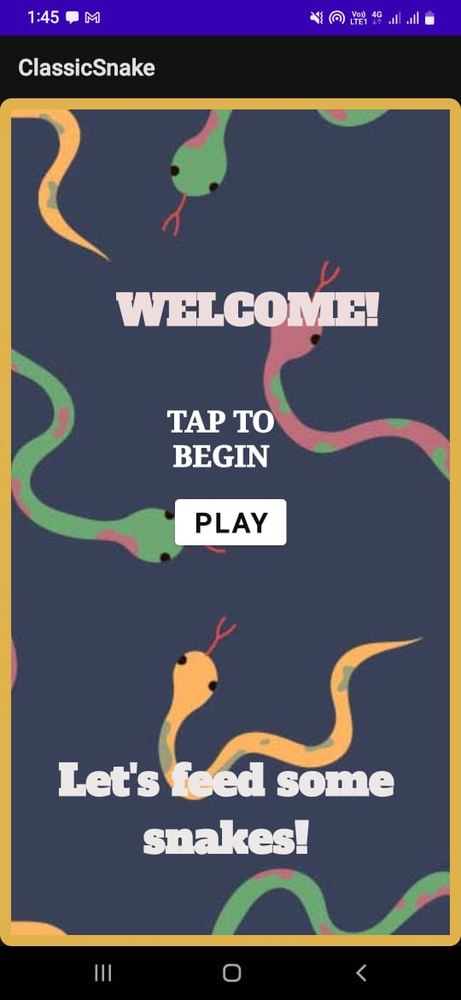
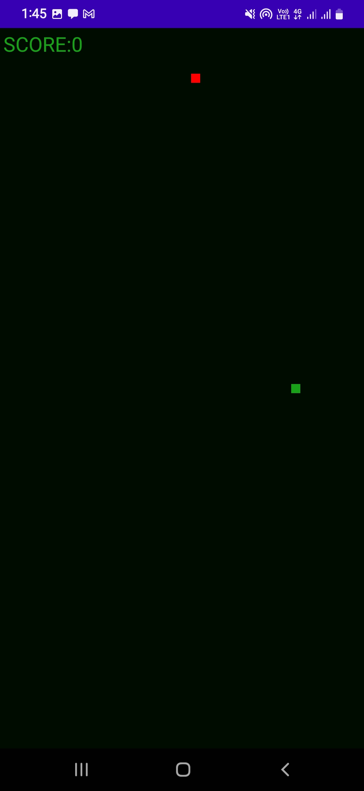
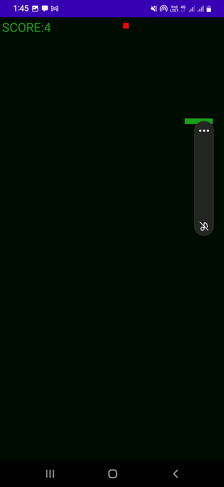
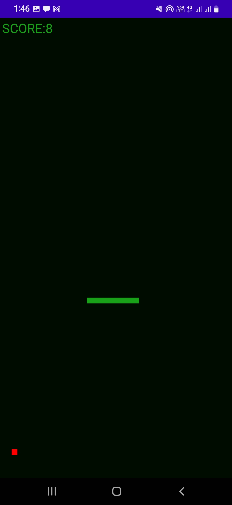

# classicsnake

A simple implementation of the classic Snake game built using Android Studio. The player controls a growing snake that must eat food while avoiding collisions with itself and the walls.

---

## Features

- Smooth snake movement with taps
- Random food spawning
- Score tracking system
- Game over detection (self-collision & wall collision)
- Simple and lightweight UI

---

## Tech Stack

- Java 
- Android Studio
- Android SDK
- XML for UI design

---

## How to Play

- Use taps to control the snake
- Eat food to grow and increase your score
- Avoid hitting walls or yourself
- Try to achieve the highest score possible

---

## Screenshots

### Main Game Screen

### Gameplay

# note: 
This is not the original source code as that was lost. this has been retrived from the apk file. 

